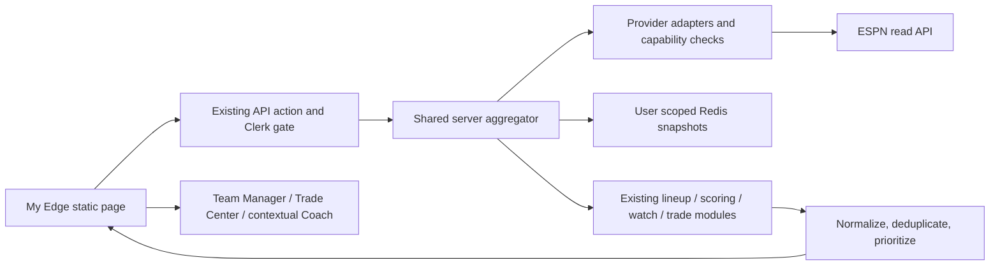

# My Edge MVP engineering design

Status: design, 2026-09-12. Foundation fixes and capability policy exist on `my-edge-foundation`;
My Edge UI/aggregator, new provider onboarding and new automation behavior are **not implemented**.
Read alongside [sport readiness](nba-nhl-readiness.md), [credential lifecycle](espn-credential-security.md)
and [connector design](espn-connector-design.md). This supersedes relevant audit observations in the
local PROJECT_HANDOFF.md; the completed Pick'em/model commit `5966a3f` must not be repeated.

## Product contract

My Edge is the signed-in answer to “What does my fantasy team need me to do today?” across connected
MLB, NFL, NBA, NHL and WNBA leagues. Public rankings, draft tools, Pick'em and Brackets feed account
creation and connection; personalized recurring management becomes the Premium retention experience.
My Edge v1 summarizes and routes into existing tools. It is not a new collection of valuation engines.

Show a count of genuinely actionable items, grouped or sorted across leagues, with sport/league/team,
a concise reason, freshness, and Review Lineup / View Waiver / View Trade / Why. A lineup injury and its
proposed swap are one issue with a remedy, not two actions inflating the count. A user with no leagues
sees Connect a League. A healthy assessed league appears in All Clear. Missing/unsupported/stale data
appears in a distinct “Could not assess” section with a recovery route. Never show “3 actions” from a
sample/mock payload in the production experience.

## Existing architecture and recommended integration

The app is static HTML and ES modules, Vercel Node functions, Upstash Redis, Clerk and Stripe. There is
no framework router, SQL database or job queue. `auth.js` exposes FE browser helpers; `_lib/auth.js`
verifies users and gets the current plan. `/api/espn` multiplexes connected-league operations, currently
paid except explicit revocation. Twelve existing handlers make unnecessary new endpoints undesirable.

Choose **a server-side aggregator calling shared modules**, initially a new `myEdge` action in the
existing `/api/espn` dispatcher. The URL is historically ESPN-named; keep provider-neutral modules under
`api/_lib/myEdge/` and adapter modules separately so future providers do not inherit an ESPN data model.
Do not make loopback HTTP calls from the aggregator into its own handler, or fan out browser requests
for every league/tool. Those repeat Clerk/provider reads and expose partial authorization inconsistently.



Extract the current `leagues` enrichment in `api/espn/index.js` into shared functions returning a
snapshot plus diagnostics. The handler still performs auth; snapshots must contain no cookies. Reuse
`fetchFanLeagues`/all-sport discovery once per account, then roster/settings per selected league with
bounded concurrency (existing mapLimit is a useful pattern). Fetch each sport dataset once per request
and build one value index per scoring signature. Capture League DNA only through its existing
current-consent gate; requesting a personal recommendation is not a new research-consent scope.

Budget the first response: proposed 8-second deadline, at most four provider reads concurrently and a
small selected-league batch. Return per-league assessed/pending/error state rather than timing out all
leagues. Use a continuation cursor bound to authenticated user and snapshot generation for larger accounts.
Vercel duration is a ceiling, not a latency target. Do not add an LLM call to first-paint aggregation.
Existing daily data refresh (11 UTC) and automation (13 UTC) are not a notification scheduler.

## Existing signal inventory

Freshness below describes current sources, not a promised service level. Source timestamps must travel
through extraction; many current enriched responses omit a per-signal timestamp.

| Signal | Existing source / provider | Availability and freshness | Extraction or missing work |
|---|---|---|---|
| Injured/inactive starters | espnFantasy parseRoster injuryStatus; lineupAdvisor injury penalties | Current league read; MLB/WNBA/NFL engine; NBA/NHL limitations | Expose evidence statuses separately from valuation; unknown/Q is not confirmed out |
| Empty required slots | league slotCounts + roster; lineupAdvisor activeOpenings/assignment | Provider roster/settings at request time; unknown mappings can corrupt assessment | Export read-only assessment of required slots, respecting reserves/flex |
| Better bench/start | buildValueIndex + suggestLineup in lineupAdvisor | Request roster + cron-built ranked dataset | Reuse thresholds and plan; no My Edge swap formula |
| IL/IR activation/move | suggestLineup reserve/roster caps and deferIl | Current roster, sport-specific heuristics; not all locks verified | Preserve current constraints, attach uncertainty and action-specific capability |
| Waiver upgrades | fetchFreeAgents + suggestLineup freeAgents + categoryRanks | Optional free-agent reads plus daily values; not a complete waiver universe | Extract deterministic analysis; report candidate-pool coverage and acquisition timing |
| Prospect/watch events | prospectWatch, enrichProspects, MLB dataset | Daily refresh; first MLB-stat/prospect flag transition, not instant transaction wire | Reuse reconcileWatch, distinguish delayed detection, preserve acknowledge state |
| Trade opportunities | api/espn buildTradeContext, computeStandings/computeNflPositions, tradeScan/tradeAdvise | Fresh league rosters + daily datasets + on-demand Anthropic | Extract existing analysis; proposals are optional slower tier; no eager LLM per league |
| Category weaknesses | categoryRanks for provider standings; computeStandings for roster-z proxy | Standings read current; underlying projections daily | Distinguish measured standings from model proxy; map actual scored cats |
| Roster/position weakness | computeNflPositions, shared draftRoster helpers and scoring modules | Existing team-analysis assumptions (including standard NFL starter counts) | Extract/validate against real lineup settings, don't silently generalize defaults |
| Lock urgency | parseRoster locked, NFL fetchNflSchedule/fetchNflByes; setLineup 409 recovery | Current flags plus schedule; not a full universal lock model | Need explicit lockAt/lock-policy coverage before deadline-based urgency |
| League health | fetchLeaguesWithRosters state/diag, missing dataset/error handling | Fan read states include expired/no_leagues/fan_error/truncated | Aggregate coverage; “no moves” alone cannot mean healthy |
| Coach explanations | api/coach/chat.js, draftContext, api/_lib/draft.js; trade explanations | On-demand context; no standardized connected action evidence yet | Add validated contextual action input, not arbitrary client-authored facts |

The current roster parser defaults an absent injuryStatus to ACTIVE and absent lock flags to false.
That is not positive evidence of health or unlock eligibility. Snapshot extraction must track field
presence/coverage separately before My Edge uses those values for All Clear or urgent actions.
Team Manager also retains unused league/Coach-state scaffolding; it is not an implemented action-context API.

Existing formulas remain sources of truth: `nflScoring.js`, `nbaScoring.js`, `nhlScoring.js`,
`mlbScoring.js`, `draftRoster.js`, `draftAI.js`, `api/_lib/lineupAdvisor.js` and `espnScoring.js`.
Some existing interfaces need extraction and some sport adapters are incomplete; those are explicit
prerequisites. No new independent recommendation formula should be created under myEdge.

## Proposed normalized contracts

Use JS objects with JSDoc and a validating boundary, consistent with current project style; TypeScript
migration is unnecessary. Example shape (design, not a persisted schema yet):

```js
{
  schemaVersion: 1,
  id: 'stable hash of provider/sport/season/league/team/type/subject',
  scope: { platform: 'espn', sport: 'nba', season: 2027, leagueId: '…', teamId: '…' },
  leagueName: '…',
  type: 'STARTER_UNAVAILABLE',
  subjects: [{ providerPlayerId: '…', datasetId: null, name: '…' }],
  severity: 'HIGH',
  headline: 'A starter needs attention',
  summary: '…',
  evidence: [{ kind: 'provider_status', value: 'OUT', source: 'espn_roster', observedAt: 'ISO' }],
  recommendation: { source: 'lineupAdvisor', reference: 'snapshot recommendation ID' },
  confidence: { level: 'HIGH', reasons: ['verified identity', 'recent provider status'] },
  impact: { kind: 'projected_points', value: null, horizon: 'today', source: null },
  urgency: { deadlineAt: null, basis: 'unknown' },
  destination: { tool: 'teamManager', scope: 'same scope', focus: 'subject ID' },
  actionable: true, // reviewing on provider can be actionable even if app cannot apply
  apply: { capability: 'READ_ONLY', reason: 'sport validation pending' },
  access: 'FREE', // proposed product gate; distinct from technical capability
  generatedAt: 'ISO',
  freshness: { rosterAt: 'ISO', valuesAt: 'ISO', expiresAt: 'ISO', stale: false }
}
```

Identity includes season AND provider AND sport. Use the new `leagueIdentity.js` for ESPN team keys;
provider-neutral storage must add the provider namespace. Player IDs are scoped to provider/sport; MLBAM
and ESPN fantasy IDs are not interchangeable. Stable action IDs allow acknowledgement/deduplication;
material evidence changes produce a new revision, not an arbitrary new card every refresh. Never store
raw credentials or arbitrary executable URLs in actions. Destinations are allowlisted tool routes.

Return a separate league assessment `{scope, status, checkedSignals, unsupportedSignals, errors,
observedAt, capabilities}` with statuses ACTIONS, ALL_CLEAR, STALE, PARTIAL, DISCONNECTED, UNSUPPORTED.
Informational assessments are not fake action objects. A failure in one league must not erase another's
valid results. Invalid or cross-user scope identifiers must be rejected on both aggregation and navigation.

## Priority and All Clear

Priority orders existing signals; it does not value players. Use a deterministic, explainable comparator:
validated urgency band → impact band based on source thresholds → confidence → stable identity. Apply
sport/source thresholds already in the originating engine, not a cross-sport comparison of MLB z-scores
with basketball points. Deadline urgency may raise priority only for a real, verified future deadline.
Confidence never converts missing data into certainty.

| Band | Examples / conditions |
|---|---|
| CRITICAL | Verified unfilled required starter or confirmed unavailable starter with imminent verified lock |
| HIGH | Starter problem without a known deadline, meaningful existing-engine lineup improvement, valid IR action or strong waiver upgrade |
| MEDIUM | Supported trade opportunity, category optimization, prospect/watch event |
| INFORMATIONAL | Connection/coverage updates, minor changes below meaningful thresholds; excluded from attention count |

If a locked starter is already unchangeable, explain it as status; don't promise a repair or manufacture
an imminent deadline. Deduplicate injury/empty-slot/upgrade cards sharing the same remedy; preserve reasons
under Why. Cap low-priority suggestions and never churn bench recommendations to fill the screen.

ALL_CLEAR means required supported checks completed with sufficient fresh data and no meaningful action:
“Your lineup looks good. No meaningful action is needed today.” Scope that claim to checked signals;
lineup clear does not mean all conceivable trades were searched. Missing roster slots, unrecognized scoring,
low identity coverage, upstream error, stale data or a disabled recommendation capability yields PARTIAL
or UNSUPPORTED, not ALL_CLEAR. NBA/NHL can show connection and roster information before qualifying.

## Freshness, caching and security

Proposed initial policies, to validate through measured latency and quota use:

| Data/action | Proposed freshness budget | Behavior when stale |
|---|---|---|
| Starter injury, lineup slots, locks | Roster/availability ≤2 minutes near an evidenced lock, ≤5 minutes otherwise | Show timestamp/stale status; suppress “urgent apply”; refresh before any submission |
| Lineup values | Current successful dataset build, normally ≤30 hours for daily sources | Explain stale valuation; don't issue confident upgrades if unavailable |
| Waiver availability | ≤5 minutes on review, authoritative re-read at action time | No claim a player remains available; no new add/drop automation in MVP |
| Trade/category analysis | ≤6 hours for roster analysis, values with explicit builtAt; refresh when entering tool | Mark model proxy and invalidate on roster changes |
| Watch/prospect | Daily dataset, normally ≤30 hours; event time versus detection time separate | Acknowledge delayed detection, no invented imminent deadline |
| League DNA/config | Daily consented sweep with fetchedAt | Research/config context only; operational rules refetched before mutations |

Redis cache keys must include Clerk user, provider connectionId, sport, season, league, team, schema
version and scoring signature where applicable. Never public/CDN-cache personal responses; set no-store.
Do not reuse shared league configs as proof of consent or ownership. Cache raw private snapshots briefly,
not credentials in responses; share only genuinely public dataset values. Invalidate on connect/disconnect,
selection/settings changes and successful apply. Avoid cross-user cache reuse even when league IDs match.
Use bounded revalidation and deduplicate in-flight reads. Cache hit/freshness/coverage/error counts are
safe telemetry; cookies, raw rosters, member IDs and prompt dumps are not default telemetry.

## Navigation and explanation

Review Lineup routes to `fantasyedge-autopilot.html` (the existing Team Manager). View Trade routes to
`fantasyedge-trade-center.html`. Why uses a contextual panel or `fantasyedge-coach.html` with validated
action context served from the authenticated API. These pages do not yet implement a consistent
provider/sport/league/team/focus deep-link contract; add that contract with My Edge v1, then server-refetch
ownership/context. Passing a fabricated plan in query parameters must never enable apply. Keep the current
manual confirmation in Team Manager; v1 does not clone full tools or embed new transaction buttons.

For common injury/slot reasons, deterministic evidence text is sufficient. Optional Coach explains the
same source recommendation; it cannot invent a replacement, override capability gates, or turn a ranking
into confirmed injury/news. Missing information must be visible to both user and Coach.

## Product access and graduated automation

Proposed, not applied to pricing/gates: FREE offers account/connection, roster health basics and a limited
useful recommendation view. PREMIUM offers comprehensive cross-league prioritized recommendations,
waiver/trade analysis, richer Coach explanations and existing eligible Team Manager functions.
VISIBLE-BUT-LOCKED cards may explain the kind of benefit and its data basis, with a clear Premium route;
do not leak a paid answer and pretend it is locked, or claim a premium opportunity before analysis exists.
Changing current `/api/espn` Premium gating to support this funnel is a separate product implementation,
not part of today's security exceptions for revocation. Connection/permission/consent never imply purchase.

Automation model: Advisor returns evidence/recommendations; Approval Required prepares a short-lived plan
bound to user, connection, scope, roster/settings revision and action; Autopilot executes only explicitly
permitted action categories. Future approval tokens must be single-use and revalidated against current
ownership, entitlement, locks and capability. Do not implement new Level 2/3 behavior in My Edge MVP.
Existing lineup Autopilot stays separately gated. Waiver claims, trades, spending and other action classes
require separate authority and provider verification, never implied by lineup opt-in.

## Foundation audit disposition and remaining risks

Confirmed and addressed: missing cron entitlement recheck; stale automation after reconnect; sportless
Autopilot/manual league identity; missing requested-team ownership check; plaintext new credential writes
and indefinite new-record retention. Legacy boolean preferences are safely MLB; old object preferences
retain their sport. Existing collisions that already overwrote a preference cannot be reconstructed.

Not an issue as originally suspected: League DNA config keys already include sport; current-version
consent checks were already fail-closed; current NBA/NHL write enablement was not present. Consent remains
independent, golf excluded, and existing shared configs retained. No shared recommendation formulas changed.

Remaining: explicit production credential migration/key provisioning; per-user read-modify-write races;
small preflight-to-provider-submit race; extra Clerk calls and provider latency under cron's 60-second
limit; incomplete sport-specific scoring and schedule/lock coverage; MLB-only single-association watch
map; seasonal frontend flags; free-user connection UI not yet built; no selected-league persistent model;
current trade proxy assumptions; no cross-league action assessment/acknowledgement service. The fixed cron
still trusts webhook-mirrored Clerk plan: webhook lag/outage is not solved by another read of that plan.

## Implementation sequence and acceptance

1. Complete operator review/provisioning/migration for credential hardening; add atomic preference updates
   before broader automation. No deployment was authorized in this task.
2. NBA then NHL sanitized read-only roster/settings capture and parser readiness, with format-specific tests.
3. Shared snapshot extraction and provider-neutral My Edge contracts; offline fixtures for partial errors,
   deduplication, no fake All Clear, identity collisions and cache isolation. Keep formulas in shared modules.
4. Advisor-only My Edge page + deep links and minimal selected-league persistence. Show unsupported coverage.
5. Connector and automatic league selection onboarding together, after security protocol tests. Instrument
   homepage → connection → first useful action, including failure/dropoff, without sensitive telemetry.
6. Verified NBA/NHL recommendations → dry-run → explicitly approved manual writes → Autopilot stages.
7. Proactive notifications and Yahoo/Sleeper expansion; separate graduated automation approvals afterwards.

This moves read-only My Edge ahead of full NBA/NHL automation and builds automatic onboarding alongside
the connector rather than afterwards: discovery already exists, while secure transport alone does not
produce a selected league or recommendation. It preserves the user's priority on foundation security.

Acceptance for the first implementation PR: zero provider writes from aggregation; same shared-engine
recommendation for identical Team Manager/My Edge input; isolated user caches; current consent unchanged;
unknown/unsupported leagues never All Clear; no inflated action counts; bounded partial success; working
existing-tool navigation. Run check:espn, check:espn-handler, check:autopilot, check:league-config,
check:league-dna, check:credentials, check:sport-readiness and verify:coach.
